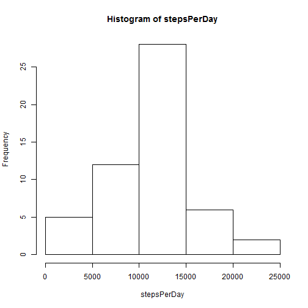
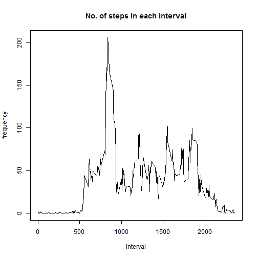
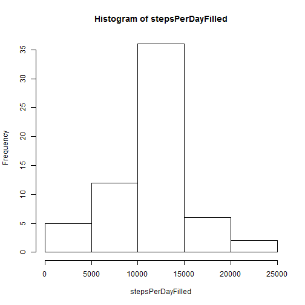

# Reproducible Research: Peer Assessment 1


## Loading and preprocessing the data

```r
set.seed(1)
setwd("C:/Nilesh/Data_Science/Coursera/Reproducible Research/CourseProject/PeerAssesment1")
activity <- read.csv("activity.csv")
```


## What is mean total number of steps taken per day?

```r
stepsPerDay <- rowsum(activity$steps, activity$date)
hist(stepsPerDay)
```

 

```r
mean <- mean(stepsPerDay, na.rm = TRUE)
median <- median(stepsPerDay, na.rm = TRUE)
```
The mean is 1.0766 &times; 10<sup>4</sup> and the median is 10765.

## What is the average daily activity pattern?

```r
average <- aggregate(activity$steps, by = list(activity$interval), FUN = mean, na.rm = TRUE)
plot(average$Group.1, average$x, type = "l", xlab = "interval", ylab = "frequency", main = "No. of steps in each interval")
```

 

```r
maxStepsInterval <- average[average$x == max(average$x), 1]
```
The maximum no of steps are taken at the interval 835.


## Imputing missing values
The missing values are filled up with the mean for the respective 5-min interval.

```r
activityDataFilled <- activity
fillValues <- function() {
  for(i in  1:length(activityDataFilled[,3])) {
    if(is.na(activityDataFilled[i,1])) {
      temp = average[average$Group.1 == activityDataFilled[i,3], 2]
      activityDataFilled[i,1] <- temp
    }
  }
  head(activityDataFilled)
  return (activityDataFilled)
}
activityDataFilled <- fillValues()

stepsPerDayFilled <- rowsum(activityDataFilled$steps, activityDataFilled$date)
hist(stepsPerDayFilled)
```

 

```r
mean <- mean(stepsPerDayFilled)
median <- median(stepsPerDayFilled)
```
The mean is 1.0766 &times; 10<sup>4</sup> and the median is 1.0766 &times; 10<sup>4</sup>. Since the missing values were replaced by the mean for the respective 5-min interval, the overall mean remains the same. On the other hand the median gets adjusted as the number of available values changed and becomes equal to the mean.

## Are there differences in activity patterns between weekdays and weekends?

```r
library(chron)
weekend <- is.weekend(as.Date(activityDataFilled$date))
activityDataFilled <- data.frame(activityDataFilled, weekday = "weekday", stringsAsFactors=FALSE)
for(i in 1:length(activityDataFilled[,4])) {
  if(weekend[i] == TRUE) {
    activityDataFilled[i,4] <- "weekend"
  }
}
activityDataFilled$weekday <- factor(activityDataFilled$weekday)

x <- split(activityDataFilled, activityDataFilled$weekday)
weekdayData <- aggregate(x$weekday$steps, by = list(x$weekday$interval), FUN = mean)
weekendData <- aggregate(x$weekend$steps, by = list(x$weekend$interval), FUN = mean)

averageDataFilled <- data.frame(weekdayData, weekday = "weekday", stringsAsFactors=FALSE)
newRow <- data.frame(weekendData, weekday = "weekend", stringsAsFactors=FALSE)
averageDataFilled <- rbind(averageDataFilled, newRow)
averageDataFilled$weekday <- factor(averageDataFilled$weekday)
library(lattice)
xyplot(averageDataFilled$x ~ averageDataFilled$Group.1 | averageDataFilled$weekday, type = "l", layout = c(1,2), xlab = "Interval", ylab = "Number of steps")
```

 
